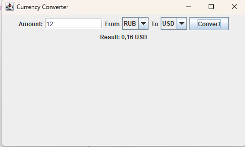

# 💱 Currency Converter

Приложение для конвертации валют на Java Swing.

## ✨ Особенности

• 💵 Ввод суммы  
• 🌍 Выбор валюты  
• 🔄 Конвертация валют  
• 📊 Отображение результата  

## 🚀 Быстрый запуск

1. Скачать проект  
2. Открыть в IntelliJ IDEA  
3. Запустить файл CurrencyConverter.java  
4. Использовать приложение  

## 📷 Скриншоты

## 🛠 Технологии

• Java  
• Java Swing  
• AWT  
